# スマホカメラ映像を用いた骨格ベース把持判定システム

## システム構成図

```mermaid
flowchart LR
    subgraph phone["📱 撮影側（スマートフォン）"]
        direction TB
        cam["カメラ\n手元映像を撮影"]
        app["配信アプリ\nIP Webcam / DroidCam\nNDI HX Camera"]
        cam --> app
    end

    subgraph net["🔗 ネットワーク / 接続"]
        direction TB
        conn["同一 LAN\nまたは USB 接続"]
    end

    subgraph pc["🖥️ 解析側 PC"]
        direction TB
        recv["映像受信\nOpenCV VideoCapture\nRTSP / HTTP / USB"]
        detect["手検出・手骨格推定\nMediaPipe Hand Landmarker\n21点 3D ランドマーク"]
        feat["特徴量計算\n指関節角度\n指先と掌の距離\n母指対向"]
        ts["時系列判定\nEMA 平滑化\n閾値判定・ヒステリシス"]
        out["結果表示・保存\nリアルタイム描画 / CSV / 動画"]
        recv --> detect --> feat --> ts --> out
    end

    subgraph result["📊 出力"]
        r1["OPEN / NO_GRASP"]
        r2["POWER_GRASP"]
        r3["PINCH_GRASP"]
        r4["把持スコア"]
    end

    app -- "映像ストリーム\nRTSP / HTTP / USB / NDI" --> conn
    conn --> recv
    out --> result
```



---

## 接続方式と技術選定

### 接続方式の比較

| 方式 | アプリ例 | プロトコル | 遅延 | 追加設定 | 推奨度 |
|------|---------|-----------|------|---------|--------|
| **Wi-Fi（同一 LAN）** | IP Webcam (Android) | RTSP / HTTP | 中 | なし | ⭐⭐⭐ 最推奨 |
| USB テザリング | IP Webcam (Android) | RTSP | 低〜中 | テザリング有効化 | ⭐⭐ |
| USB 直結 | DroidCam | USB (仮想カメラ) | 低 | PC 側ドライバ要 | ⭐⭐ |
| NDI | NDI HX Camera | NDI | 低 | NDI Tools 要 | ⭐ |

**推奨: IP Webcam + Wi-Fi + RTSP**
- 追加ライブラリ不要（OpenCV が RTSP をネイティブ対応）
- アプリが無料で設定が簡単
- `--source` に URL を渡すだけで `skeleton_grip_detector.py` がそのまま動く

---

## 技術スタック

### 撮影側（スマートフォン）

| 項目 | 採用技術 |
|------|---------|
| OS | Android |
| 配信アプリ | [IP Webcam](https://play.google.com/store/apps/details?id=com.pas.webcam)（無料） |
| 配信プロトコル | RTSP（H.264） |
| 接続 | Wi-Fi（解析 PC と同一 LAN） |

### 解析側 PC

| 層 | 採用技術 | バージョン |
|----|---------|-----------|
| 言語 | Python | 3.12 |
| 環境管理 | uv | 0.9+ |
| 映像取得 | OpenCV | 4.9+ |
| 骨格推定 | MediaPipe Hand Landmarker | 0.10+ |
| 数値計算 | NumPy | 1.26+ |

---

## セットアップ手順

### 1. スマートフォン側

1. Google Play から **IP Webcam** をインストール
2. アプリを起動 →「サーバーを起動」をタップ
3. 画面下部に表示された IP アドレスとポートを控える
   ```
   例: 192.168.1.5:8080
   ```
4. ブラウザで `http://192.168.1.5:8080` を開いて映像が見えることを確認

### 2. PC 側（初回のみ）

```bash
# リポジトリのルートで実行
uv sync
```

### 3. 実行

```bash
# RTSP で接続（H.264、推奨）
uv run python お試し/skeleton_grip_detector.py \
  --source "rtsp://192.168.1.5:8080/h264_ulaw.sdp"

# HTTP MJPEG で接続（接続できない場合の代替）
uv run python お試し/skeleton_grip_detector.py \
  --source "http://192.168.1.5:8080/video"

# CSV も保存したい場合
uv run python お試し/skeleton_grip_detector.py \
  --source "rtsp://192.168.1.5:8080/h264_ulaw.sdp" \
  --csv grip_log.csv
```

> **IP アドレスの確認方法**
> IP Webcam アプリの画面、または Android の「設定 > Wi-Fi > 接続中のネットワーク詳細」で確認できます。

---

## 出力仕様

| 状態 | 意味 |
|------|------|
| `OPEN / NO_GRASP` | 手が開いている / 把持姿勢でない |
| `POWER_GRASP` | 指全体で包み込む把持姿勢 |
| `PINCH_GRASP` | 親指と人差し指によるつまみ把持姿勢 |

### CSV 出力カラム

```
timestamp, frame_index, hand_side, grip_state, grip_type,
raw_score, smooth_score, power_score, pinch_score,
flexion_{thumb,index,middle,ring,pinky},
closure_{thumb,index,middle,ring,pinky},
pip_angle_{...}, dip_angle_{...}, palm_width
```

---

## 注意事項

- **物体検出は行いません。** 判定するのは「把持に対応する手指骨格になっているか」です。空の握り拳と物体を持った手の骨格は区別できません。
- 解析 PC と スマートフォンが **同一 Wi-Fi ネットワーク** に接続されている必要があります。
- IP Webcam のデフォルトポートは `8080`。別ポートに変更した場合は URL を合わせてください。
